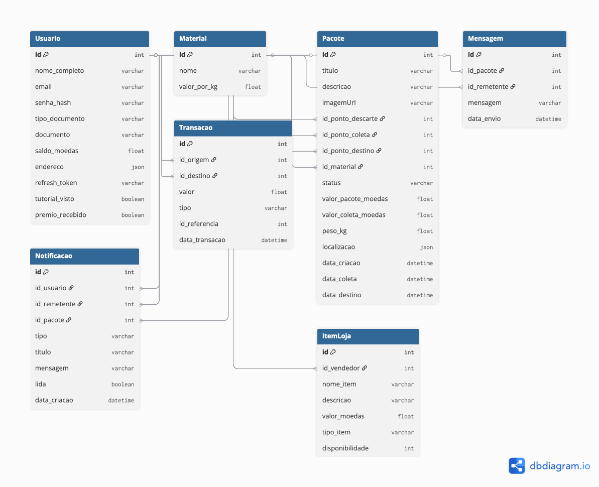

# Modelagem do Banco de Dados

Este documento descreve a estrutura final e os relacionamentos do banco de dados relacional (PostgreSQL) utilizado na plataforma Descarte Vivo. A estrutura foi implementada utilizando o Prisma ORM, garantindo integridade referencial e tipagem forte.

## Entidades e Atributos

A seguir, estão as principais entidades (tabelas) do sistema, seus atributos e a descrição de suas funcionalidades.

### 1. `Usuario`
Representa todos os atores da plataforma (Descarte, Coleta e Destino).
- `id` (Int, PK, Autoincrement): Identificador único.
- `nome_completo` (String): Nome do usuário.
- `email` (String, Unique): Login do usuário.
- `senha_hash` (String): Senha criptografada (Bcrypt).
- `tipo_documento` (String): CPF ou CNPJ.
- `documento` (String, Unique): Número do documento.
- `saldo_moedas` (Float, Default: 0): Carteira digital do usuário.
- `endereco` (Json, Nullable): Objeto JSON contendo { rua, numero, bairro, cidade, uf, lat, lng }.
- `refresh_token` (String, Nullable): Token para renovação de sessão (JWT).

### 2. `Material`
Cataloga os tipos de resíduos aceitos na plataforma.
- `id` (Int, PK, Autoincrement): Identificador único.
- `nome` (String, Unique): Ex: 'Plástico', 'Metal', 'Vidro'.
- `valor_por_kg` (Float): Valor base de referência para cálculos automáticos.

### 3. `Pacote`
A entidade central que representa o resíduo sendo negociado. Possui uma máquina de estados complexa.
- `id` (Int, PK, Autoincrement): Identificador único.
- `titulo` (String): Título curto do pacote (Ex: "Garrafas PET limpas"). (Novo)
- `descricao` (String, Nullable): Detalhes adicionais sobre o estado do material. (Novo)
- `imageUrl` (String, Nullable): URL pública da imagem armazenada no Cloudinary. (Novo)
- `peso_kg` (Float): Peso do material.
- `id_material` (Int, FK): Tipo do material.
- `status` (String): Estado atual ('DISPONIVEL', 'AGUARDANDO_APROVACAO', 'AGUARDANDO_COLETA', 'A_COLETAR', 'AGUARDANDO_RETIRADA', 'EM_TRANSPORTE', 'DESTINADO').
- `valor_pacote_moedas` (Float): Valor a ser pago ao descartador.
- `valor_coleta_moedas` (Float, Nullable): Valor do serviço de frete (se houver).
- `localizacao` (Json, Nullable): Coordenadas e endereço de retirada.
- `id_ponto_descarte` (Int, FK): Quem criou.
- `id_ponto_coleta` (Int, FK, Nullable): Quem está transportando.
- `id_ponto_destino` (Int, FK, Nullable): Quem comprou.
- `data_criacao` (DateTime): Registro inicial.
- `data_coleta` (DateTime, Nullable): Momento da retirada.
- `data_destino` (DateTime, Nullable): Momento da finalização.

### 4. `Mensagem`
Chat contextual atrelado a um pacote específico.
- `id`(Int, PK, Autoincrement): Identificador único.
- `id_pacote` (Int, FK): Onde a conversa ocorre.
- `id_remetente` (Int): Quem enviou (não chaveada diretamente para evitar ciclos complexos, mas referenciando ID de usuário).
- `mensagem` (String): Texto.
- `data_envio` (DateTime): Timestamp.

### 5. `Transacao`
Registro imutável de movimentações financeiras (Modelo Escrow).
- `id` (Int, PK, Autoincrement): Identificador único.
- `id_origem` (Int, FK, Nullable): Quem pagou (Se nulo, veio do sistema).
- `id_destino` (Int, FK, Nullable): Quem recebeu (Se nulo, está retido no sistema).
- `valor` (Float): Quantidade de moedas.
- `tipo` (String): 'RESERVA_MATERIAL', 'PAGAMENTO_SERVICO', 'ESTORNO', etc.
- `id_referencia` (Int, Nullable): ID do pacote ou item vinculado.
- `data_transacao` (DateTime): Momento do evento.

### 6. `Notificacao` (Nova Entidade)
Sistema de alertas assíncronos gerados por eventos nos pacotes.
- `id` (Int, PK, Autoincrement): Identificador único.
- `id_usuario` (Int, FK): Destinatário da notificação.
- `id_remetente` (Int, FK, Nullable): Usuário que gerou a ação (para exibir nome/foto).
- `id_pacote` (Int, FK, Nullable): Contexto da notificação.
- `tipo` (String): 'SOLICITACAO', 'CONFIRMACAO', 'AVISO'.
- `titulo` (String): Cabeçalho do alerta.
- `mensagem` (String): Texto descritivo.
- `lida` (Boolean, Default: false): Controle de leitura/badge.
- `data_transacao` (DateTime): Momento do alerta.

## Relacionamentos

Abaixo, um resumo dos principais relacionamentos entre as tabelas.

- `Pacote` **(1:N)** `Material`: Todo pacote pertence a um tipo de material.
- `Pacote` **(1:N)** `Mensagem`: Um pacote funciona como uma sala de chat.
- `Pacote` **(1:N)** `Notificacao`: As notificações nascem de alterações no pacote.
- `Usuario` **(1:N)** `Pacote`: Um usuário possui 3 listas distintas de pacotes: pacotesDescarte, pacotesColeta e pacotesDestino.
- `Usuario` **(1:N)** `Notificacao`: Relacionamento duplo. notificacoesRecebidas (Inbox) e notificacoesEnviadas (Histórico de ações).

